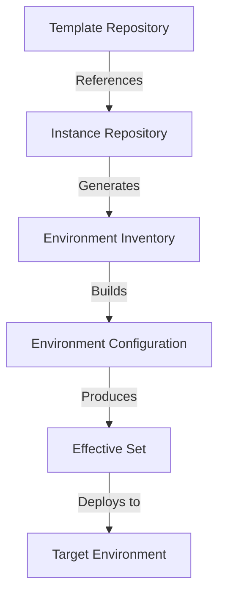
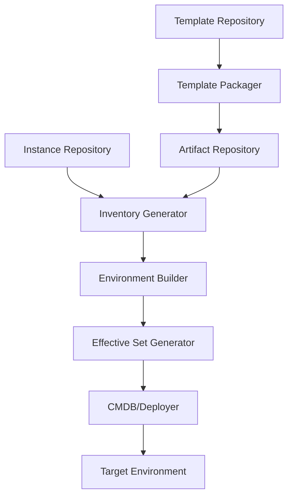
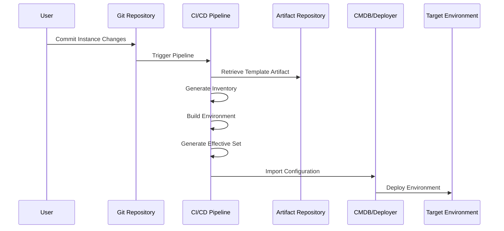

# Environment Generation (EnvGene) Guide

## Introduction

The Environment Generation System (EnvGene) is a powerful tool designed to create and manage environments from predefined templates. It follows a template-instance pattern where environment templates define the structure and parameters, while instances represent specific environment deployments with their unique configurations.

This guide provides comprehensive documentation on the environment generation system, including template repositories, instance repositories, their relationship, and the different stages of the environment generation process.

## Table of Contents

1. [Template Repository](template-repository.md)
   - Overview of template repositories
   - Structure and organization
   - Key components (main template files, template components, environment-specific schema)
   - Template macros and their usage
   - Template versioning

2. [Instance Repository](instance-repository.md)
   - Overview of instance repositories
   - Structure and organization
   - Key components (environment definition, cloud passport, parameters, credentials)
   - Instance customization options

3. [Template-Instance Relationship](template-instance-relationship-guide.md)
   - Core relationship principles
   - How templates and instances work together
   - Parameter customization and inheritance
   - Template rendering process
   - Versioning and evolution
   - Benefits of the template-instance pattern

4. [Environment Generation Process](environment-generation-process.md)
   - Inventory generation
   - Environment build
   - Effective set generation
   - CI/CD pipeline integration
   - Environment update process
   - Troubleshooting and best practices

## Quick Start

To get started with the Environment Generation System:

1. **Set up a Template Repository**:
   - Create template components (tenant, cloud, namespaces)
   - Define main template files
   - Create environment-specific schemas
   - Version and package templates as artifacts

2. **Set up an Instance Repository**:
   - Create environment definition files
   - Define cloud passports
   - Create environment-specific parameters
   - Set up credentials

3. **Generate Environments**:
   - Run the inventory generation process
   - Build the environment configuration
   - Generate the effective set
   - Deploy to the target environment

For detailed instructions on each step, refer to the corresponding sections in this guide.

## System Architecture

The Environment Generation System consists of several components working together:

1. **Template Repository**: Contains template definitions and components
2. **Template Packager**: Packages templates as versioned artifacts
3. **Artifact Repository**: Stores template artifacts
4. **Instance Repository**: Contains environment-specific configurations
5. **Inventory Generator**: Generates environment inventory from instance repository
6. **Environment Builder**: Builds environment configuration from templates and inventory
7. **Effective Set Generator**: Generates final effective set for deployment
8. **CMDB/Deployer**: Imports configuration and deploys to target environment
9. **Target Environment**: The deployed environment

## CI/CD Integration

The Environment Generation System is designed to integrate with CI/CD pipelines:

For detailed information on CI/CD integration, refer to the [Environment Generation Process](environment-generation-process.md) section.

## Best Practices

1. **Template Design**:
   - Keep templates modular and reusable
   - Use environment-specific schemas for validation
   - Document template parameters and requirements

2. **Instance Configuration**:
   - Follow naming conventions for environments
   - Organize parameters by namespace
   - Secure sensitive information in credential files

3. **Environment Generation**:
   - Automate the generation process through CI/CD
   - Test configurations before deployment
   - Monitor the generation and deployment process

4. **Version Control**:
   - Keep all templates and instance configurations in version control
   - Use semantic versioning for templates
   - Track changes to environments over time

For more best practices, refer to the individual sections in this guide.

## Conclusion

The Environment Generation System provides a powerful and flexible way to create and manage environments. By separating templates from instances, it enables standardization, reusability, and customization of environment configurations.

This guide provides comprehensive documentation on all aspects of the system, from template and instance repositories to the environment generation process. Use it as a reference for setting up, using, and troubleshooting the Environment Generation System.
