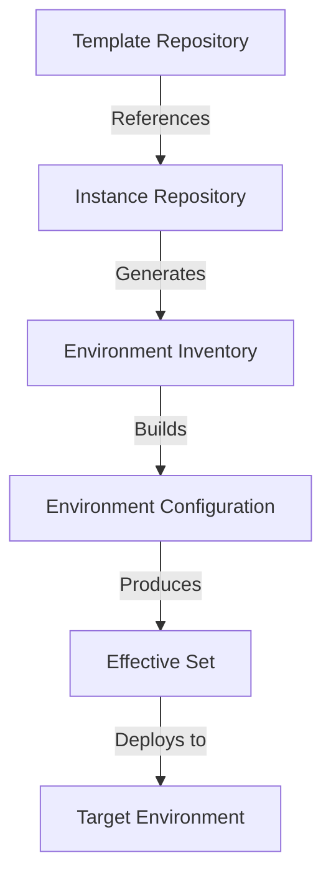
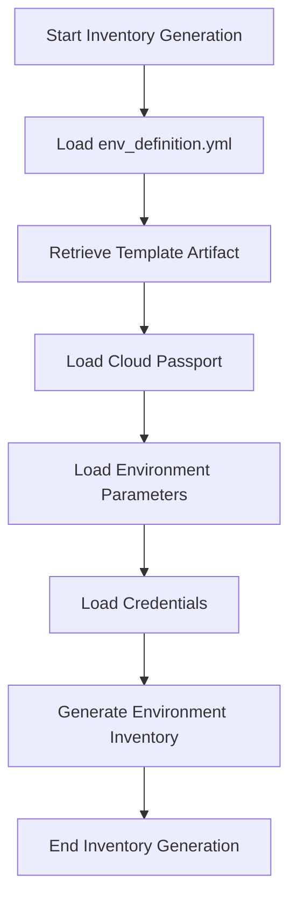
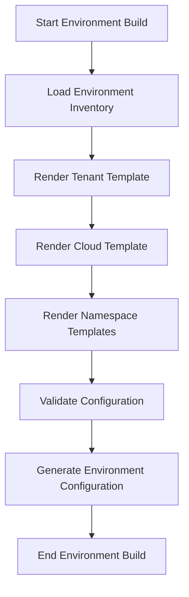
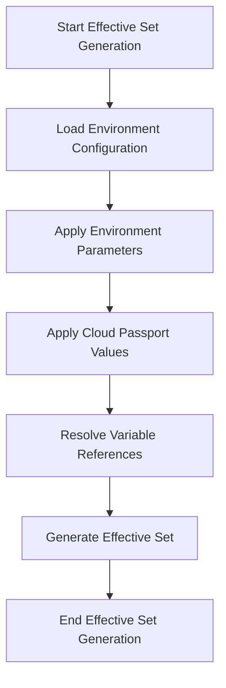
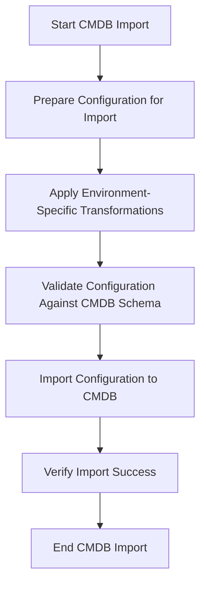
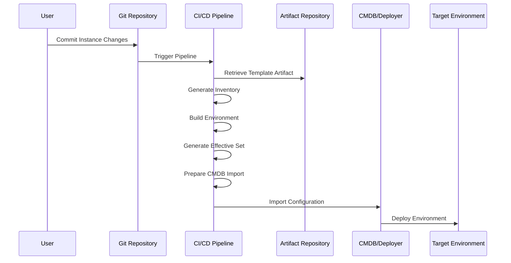

# Environment Generation Process

## Overview

The environment generation process transforms templates and instance configurations into deployable environment configurations. This document explains the different stages of this process, including inventory generation, environment build, and effective set generation.



## Stages of Environment Generation

### 1. Inventory Generation

Inventory generation is the first stage of the environment generation process. It involves collecting and organizing all the necessary information from the instance repository to prepare for environment building.

#### Process Flow



#### Key Components

1. **Environment Definition**: The `env_definition.yml` file provides the core configuration for the environment, including template references and parameter set locations. For detailed information about the structure and schema of this file, refer to the [Instance Repository Documentation](./instance-repository.md#environment-definition-file).

2. **Template Artifact Retrieval**: The specified template artifact is retrieved from the artifact repository based on the version information in the environment definition. The artifact contains all template components needed for environment generation.

3. **Cloud Passport Loading**: The cloud passport file for the target cloud is loaded to provide cloud-specific configuration, including API endpoints, credentials, and service URLs.

4. **Parameter Loading**: Environment-specific parameters are loaded from the parameter files specified in the environment definition. These parameters customize the environment configuration for specific needs.

5. **Credential Loading**: Credentials are loaded from the credential files specified in the environment definition. These provide secure access to various services and resources. For detailed information about credential management, encryption, and decryption, refer to the [Credential Management Documentation](./credential-management.md).

6. **Inventory Generation**: All the collected information is organized into an environment inventory structure that will be used in the environment build stage. This includes template references, parameters, cloud passport values, and credentials.

#### Pipeline Parameters

The inventory generation process can be controlled through pipeline parameters:

| Parameter | Description |
|-----------|-------------|
| `INIT_ENV_INVENTORY` | Flag to initialize environment inventory |
| `ENV_NAME` | Name of the environment to generate inventory for |
| `CLOUD_NAME` | Name of the cloud to use for the environment |
| `TEMPLATE_VERSION` | Version of the template to use (overrides env_definition.yml) |
| `ADDITIONAL_VARS` | Additional variables to pass to the template rendering process |

### 2. Environment Build

The environment build stage takes the generated inventory and uses it to render the template components into a complete environment configuration.

#### Process Flow



#### Key Components

1. **Inventory Loading**: The environment inventory generated in the previous stage is loaded.

2. **Template Rendering**: The template components (tenant, cloud, namespaces) are rendered using Jinja2 with the environment-specific parameters, cloud passport values, and additional template variables.

3. **Configuration Validation**: The rendered configuration is validated against the environment-specific schema to ensure it meets all requirements.

4. **Environment Configuration Generation**: The final environment configuration is generated, including all tenant, cloud, and namespace configurations.

#### Build Jobs

The environment build process typically involves several CI/CD jobs:

1. **env_builder**: Main job that builds the environment configuration from templates and parameters
2. **get_passport**: Retrieves the cloud passport for the target cloud
3. **deploytool_import**: Imports the generated configuration into the deployment tool or CMDB

### 3. Effective Set Generation

The effective set generation stage combines the rendered templates, environment-specific parameters, and cloud passport values to create the final effective set that will be deployed to the target environment.

#### Process Flow



#### Key Components

1. **Configuration Loading**: The environment configuration generated in the previous stage is loaded.

2. **Parameter Application**: Environment-specific parameters are applied to the configuration, overriding any default values.

3. **Cloud Passport Application**: Cloud passport values are applied to the configuration, providing cloud-specific settings.

4. **Variable Resolution**: All variable references in the configuration are resolved to their final values.

5. **Effective Set Generation**: The final effective set is generated, containing all the resolved configuration values that will be deployed to the target environment.

#### Effective Set Structure

The effective set is typically organized by namespace, with each namespace containing its specific configuration:

```
effective_set/
├── tenant.yml                # Tenant configuration
├── cloud.yml                 # Cloud configuration
├── namespaces/
│   ├── core.yml              # Core namespace configuration
│   ├── bss.yml               # BSS namespace configuration
│   ├── oss.yml               # OSS namespace configuration
│   └── ...                   # Other namespace configurations
└── parameters/
    ├── global.yml           # Global parameters
    ├── core-params.yml      # Core namespace parameters
    ├── bss-params.yml       # BSS namespace parameters
    └── ...                   # Other namespace parameters
```

### 4. CMDB Import Logic

After the effective set is generated, the configuration needs to be imported into the Configuration Management Database (CMDB) or deployer system for actual deployment to the target environment.

#### Process Flow



#### Key Components

1. **Configuration Preparation**: The effective set is prepared for import into the CMDB, including formatting and structure adjustments.

2. **Environment-Specific Transformations**: Based on the `config` settings in the environment definition, specific transformations are applied:
   - If `updateCredIdsWithEnvName` is true, credential IDs are updated with the environment name
   - If `updateRPOverrideNameWithEnvName` is true, resource profile override names are updated with the environment name

3. **Schema Validation**: The configuration is validated against the CMDB schema to ensure compatibility.

4. **Import Process**: The configuration is imported into the CMDB using the specified deployer API.

5. **Import Verification**: The import process is verified to ensure all components were successfully imported.

#### CMDB Import Jobs

The CMDB import process is typically handled by the `deploytool_import` job in the CI/CD pipeline, which:

1. Takes the generated effective set as input
2. Connects to the specified CMDB/deployer system
3. Transforms the configuration as needed for the target CMDB
4. Imports the configuration using the CMDB's API
5. Verifies the import was successful
6. Reports any issues or conflicts

#### Import Parameters

The CMDB import process can be controlled through various parameters:

| Parameter | Description |
|-----------|-------------|
| `CMDB_URL` | URL of the CMDB/deployer system |
| `CMDB_NAME` | Name of the CMDB/deployer to use |
| `IMPORT_MODE` | Mode of import (e.g., create, update, replace) |
| `SKIP_VALIDATION` | Flag to skip validation before import |
| `DRY_RUN` | Flag to perform a dry run without actual import |
| `IGNORE_CONFLICTS` | Flag to ignore conflicts during import |

## CI/CD Pipeline Integration

The environment generation process is typically integrated into a CI/CD pipeline to automate the creation and deployment of environments.

### Pipeline Flow



The CI/CD pipeline typically includes the following jobs:

1. **env_builder**: Main job that builds the environment configuration from templates and parameters
2. **get_passport**: Retrieves the cloud passport for the target cloud
3. **deploytool_import**: Imports the generated configuration into the CMDB/deployer
4. **dynamic_pipeline**: Optional job that can generate additional pipeline jobs based on the environment configuration

### Pipeline Variables

The CI/CD pipeline can be controlled through various variables:

| Variable | Description |
|----------|-------------|
| `ENV_NAME` | Name of the environment to deploy |
| `CLOUD_NAME` | Name of the cloud to deploy to |
| `TEMPLATE_VERSION` | Version of the template to use |
| `SKIP_VALIDATION` | Flag to skip validation steps |
| `DRY_RUN` | Flag to perform a dry run without actual deployment |
| `IMPORT_TO_CMDB` | Flag to import the configuration to the CMDB |

## Environment Update Process

When an environment needs to be updated, the following process is typically followed:

1. Update the instance repository with new parameters, cloud passport values, or template version
2. Commit the changes to the Git repository
3. The CI/CD pipeline is triggered automatically
4. The pipeline generates a new inventory, builds the environment, and generates a new effective set
5. The new configuration is imported into the CMDB/deployer
6. The changes are deployed to the target environment

This process ensures that all changes to the environment are tracked, versioned, and deployed in a controlled manner.

## Troubleshooting

Common issues in the environment generation process and their solutions:

| Issue | Possible Causes | Solutions |
|-------|----------------|-----------|
| Template rendering fails | Invalid Jinja2 syntax, missing variables | Check template syntax, ensure all required variables are provided |
| Parameter validation fails | Invalid parameter values, missing mandatory parameters | Check parameter values against schema, ensure all mandatory parameters are provided |
| Cloud passport not found | Incorrect cloud name, missing cloud passport file | Verify cloud name, ensure cloud passport file exists |
| CMDB import fails | Invalid configuration, CMDB connection issues | Validate configuration, check CMDB connection |

## Best Practices

1. **Version Control**: Keep all templates and instance configurations in version control
2. **Parameter Validation**: Use environment-specific schemas to validate parameters
3. **CI/CD Integration**: Automate the environment generation process through CI/CD pipelines
4. **Testing**: Test environment configurations before deployment
5. **Documentation**: Document template structures and parameter requirements
6. **Monitoring**: Monitor the environment generation process and deployments
7. **Backup**: Backup environment configurations before making changes
