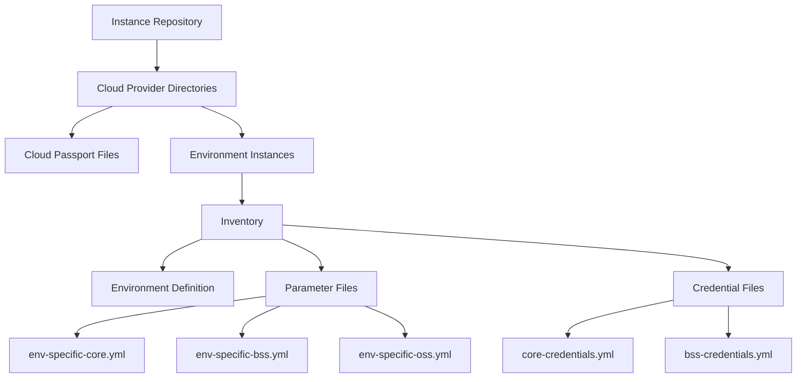

# Instance Repository

## Overview

An instance repository contains the specific configuration for a particular environment deployment. It references a template from the template repository and provides environment-specific parameters, cloud passports, and credentials. Instance repositories represent concrete environment deployments with their unique configurations and customizations.

Key characteristics of instance repositories:
- Reference a specific template and version
- Contain environment-specific parameters and configurations
- Include cloud passports for cloud provider access
- Store credentials and resource profiles as needed
- Define the specific deployment of an environment

## Structure

The instance repository follows a specific directory structure:

```
environments/
├── sample-cloud-name/                      # Cloud provider directory
│   ├── sample-cloud-name.yml               # Cloud passport file
│   ├── simplest-env/                       # Environment instance directory
│   │   └── Inventory/
│   │       ├── env_definition.yml          # Environment definition file
│   │       └── parameters/                 # Environment-specific parameters
│   │           └── env-specific.yml
│   └── composite-full/                     # Another environment instance
│       └── Inventory/
│           ├── env_definition.yml
│           ├── parameters/
│           │   ├── env-specific-core.yml
│           │   ├── env-specific-bss.yml
│           │   └── env-specific-oss.yml
│           └── credentials/                # Environment-specific credentials
│               ├── core-credentials.yml
│               └── bss-credentials.yml
└── another-cloud-name/                     # Another cloud provider
    └── ...
```



## Key Components

### Environment Definition File

The `env_definition.yml` file is the central configuration file for an environment instance. It follows a specific schema with two main sections:

#### 1. Inventory Section

The `inventory` section contains environment metadata and configuration:

- `environmentName`: Name of the environment (required)
- `tenantName`: Name of the tenant for the environment
- `deployer`: Name of the Application Deployer
- `cloudPassport`: Name of the Cloud Passport
- `clusterUrl`: URL of the cluster
- `description`: Environment description
- `owners`: Environment owners
- `config`: Configuration settings
  - `updateCredIdsWithEnvName`: Boolean to update credential IDs with environment name
  - `updateRPOverrideNameWithEnvName`: Boolean to update resource profile override names

#### 2. EnvTemplate Section

The `envTemplate` section contains template reference and customization:

- `name`: Template name (required)
- `additionalTemplateVariables`: Key-value pairs for template processing
- `sharedTemplateVariables`: Array of file names in 'shared-template-variables' folders
- `envSpecificParamsets`: Environment-specific deployment parameters by namespace
- `envSpecificTechnicalParamsets`: Environment-specific technical parameters by namespace
- `envSpecificE2EParamsets`: Environment-specific E2E parameters by namespace
- `envSpecificResourceProfiles`: Environment-specific resource profiles override
- `sharedMasterCredentialFiles`: Array of file names in 'shared-credentials' folders

#### Template Artifact Reference

There are two ways to reference a template artifact in the `envTemplate` section:

1. **Full GAV (Group-Artifact-Version) Approach**:

   ```yaml
   templateArtifact:
     registry: artifactory
     repository: snapshotRepository
     artifact:
       group_id: org.qubership
       artifact_id: env-templates
       version: "2.1.0"
   ```

   This approach provides complete details about the artifact including registry, repository, group ID, artifact ID, and version.

2. **Simplified Artifact Reference**:

   ```yaml
   artifact: "env-templates:1.0.0"
   ```

   This approach uses a simplified string format `artifact_id:version` for quick reference.

The environment definition must include either `templateArtifact` or `artifact`, but not both.

#### Examples

Example of a minimal environment definition:

```yaml
inventory:
  environmentName: simplest-env
  description: "Simplest environment"
  owners: "owner@example.com"

envTemplate:
  name: simple
  artifact: "env-templates:1.0.0"
```

Example of a comprehensive environment definition:

```yaml
inventory:
  environmentName: override-env-name
  tenantName: example-tenant
  deployer: app-deployer
  cloudPassport: sample-cloud-name
  clusterUrl: https://k8s.example.org:6443
  description: "Full environment with all features"
  owners: "owner1@example.com, owner2@example.com"
  config:
    updateCredIdsWithEnvName: true
    updateRPOverrideNameWithEnvName: false

envTemplate:
  name: composite-prod
  additionalTemplateVariables:
    GLOBAL_LEVEL_PARAM1: "global-value1"
    GLOBAL_LEVEL_PARAM2: "global-value2"
  sharedTemplateVariables:
    - shared-var-1
    - shared-var-2
  envSpecificParamsets:
    core:
      - parameters/env-specific-core.yml
    bss:
      - parameters/env-specific-bss.yml
  envSpecificResourceProfiles:
    core: resource-profiles/core-profile.yml
  sharedMasterCredentialFiles:
    - master-cred-1
    - master-cred-2
  templateArtifact:
    registry: artifactory
    repository: snapshotRepository
    artifact:
      group_id: org.qubership
      artifact_id: env-templates
      version: "2.1.0"
```

### Cloud Passport

The cloud passport file (e.g., `sample-cloud-name.yml`) contains cloud-specific configuration and credentials needed to access cloud resources:

```yaml
version: 1.5
cloud:
  CLOUD_API_HOST: "api.cloud-provider.com"
  CLOUD_API_PORT: 443
  CLOUD_API_TOKEN: "{{ lookup('env', 'CLOUD_API_TOKEN') }}"
  SERVICE_URL: "https://service.cloud-provider.com"
  CREDENTIALS_REF: "credentials/cloud-provider-creds.yml"
```

### Environment-Specific Parameters

Parameter files (e.g., `env-specific-core.yml`) contain namespace-specific configuration parameters:

```yaml
deployParameters:
  PARAM1: value1
  PARAM2: value2
  NESTED_PARAMS:
    NESTED1: nested-value1
    NESTED2: nested-value2

```

### Credentials

Credential files contain sensitive information such as usernames, passwords, and API keys needed for environment deployment and operation:

```yaml
credentials:
  DATABASE:
    username: "db_user"
    password: "envgene.creds.get('DB_PASSWORD').password"    
  API_ACCESS:
    secret: "envgene.creds.get('API_KEY').secret"
```

## Instance Customization

Instance repositories allow for extensive customization of environments through:

1. **Environment-Specific Parameters**: Override default template parameters
2. **Additional Template Variables**: Provide global variables for template rendering
3. **Shared Template Variables**: Define variables shared across namespaces
4. **Cloud Passport Overrides**: Customize cloud provider configurations
5. **Credential Management**: Securely manage environment-specific credentials

This flexibility enables the creation of diverse environments from the same template, each tailored to specific requirements while maintaining a consistent structure.
