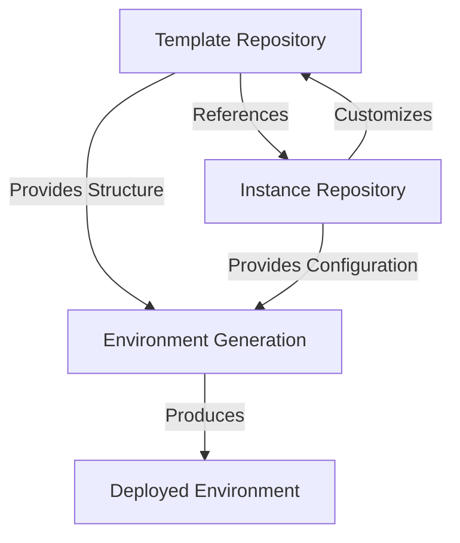
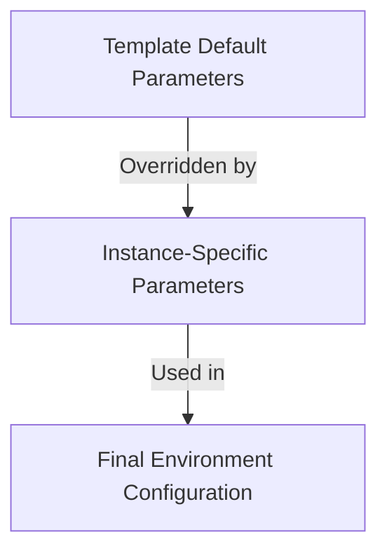
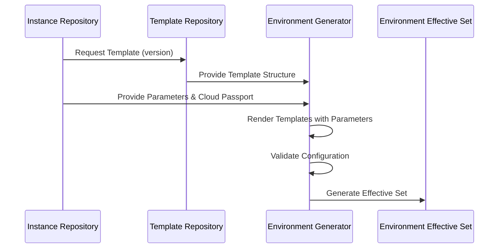

# Relationship Between Template and Instance Repositories

## Overview

The environment generation system is built on the relationship between template repositories and instance repositories. This document explains how these two components interact to create consistent, reproducible environments.



## Core Relationship Principles

1. **Template-Instance Pattern**: Templates define the structure and behavior, while instances provide specific configurations
2. **Version-Controlled References**: Instances reference specific template versions for stability and reproducibility
3. **Parameter Inheritance**: Instances can override template defaults with environment-specific parameters
4. **Separation of Concerns**: Templates focus on structure, instances focus on configuration

## How Templates and Instances Work Together

### Template Selection and Referencing

An instance repository references a specific template from the template repository through the `env_definition.yml` file:

```yaml
# In instance repository's env_definition.yml
env_template: composite-prod
template_artifact:
  version: "2.1.0"
  group: "com.example"
  artifact: "env-templates"
  repository: "https://repo.example.com"
```

This establishes a direct link to a specific version of a template, ensuring that the environment structure remains consistent even as templates evolve.

### Parameter Customization

Templates define the structure and default parameters, while instances provide environment-specific customizations:



The parameter hierarchy follows this order of precedence (highest to lowest):
1. Environment-specific parameters in instance repository
2. Cloud passport values in instance repository
3. Additional template variables in instance repository
4. Default values in template repository

### Template Rendering Process

When an environment is generated, the following process occurs:

1. The template is retrieved based on the instance's reference
2. Environment-specific parameters are loaded from the instance repository
3. Cloud passport values are loaded from the instance repository
4. Template components (tenant, cloud, namespaces) are rendered using Jinja2 with:
   - Template macros
   - Environment-specific parameters
   - Cloud passport values
   - Additional template variables
5. The rendered configuration is validated against the environment-specific schema
6. The final environment configuration is generated



## Versioning and Evolution

### Template Versioning

Templates are versioned using semantic versioning (e.g., v1.2.3), allowing instances to reference specific template versions. This ensures that:

1. Environment generation remains consistent over time
2. Template updates don't automatically affect existing environments
3. Environments can be upgraded to newer template versions in a controlled manner

### Instance Evolution

Instance repositories can evolve independently of templates by:

1. Updating environment-specific parameters
2. Modifying cloud passport configurations
3. Adding or removing credentials
4. Changing additional template variables

These changes don't require template updates and allow for environment-specific customization without affecting the underlying structure.

### Template Upgrades

When a template is updated, instances can be upgraded by:

1. Updating the template version reference in `env_definition.yml`
2. Adjusting environment-specific parameters as needed for compatibility
3. Testing the new configuration before deployment

This controlled upgrade process ensures that environments remain stable while allowing for evolution of the underlying templates.

## Benefits of the Template-Instance Relationship

1. **Consistency**: All environments based on the same template share a common structure
2. **Reusability**: Templates can be reused across multiple environments
3. **Customization**: Each environment can be customized without affecting others
4. **Versioning**: Changes to templates are tracked and controlled
5. **Separation of Concerns**: Template developers focus on structure, environment owners focus on configuration
6. **Governance**: Templates can enforce standards and best practices across environments
