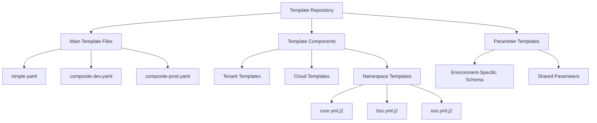

# Template Repository

## Overview

A template repository is a structured collection of configuration files that define the blueprint for environment creation. It serves as a standardized definition of environment components including Tenant, Cloud, Namespaces, and Parameters. Templates are versioned and packaged as artifacts, allowing for consistent environment creation across different deployments.

Key benefits of using template repositories:
- Standardization of environment configurations
- Version control for environment templates
- Reusability across multiple environment instances
- Separation of structure (template) from specific configurations (instance)

## Structure

The template repository follows a specific directory structure:

```
templates/
├── env_templates/
│   ├── simple.yaml                  # Simple template definition
│   ├── composite-dev.yaml           # Development template definition
│   ├── composite-prod.yaml          # Production template definition
│   ├── simple/                      # Simple template components
│   │   ├── tenant.yml.j2            # Tenant definition template
│   │   ├── cloud.yml.j2             # Cloud definition template
│   │   └── billing.yml.j2           # Namespace definition template
│   ├── composite-dev/               # Development template components
│   │   ├── tenant.yml.j2
│   │   ├── cloud.yml.j2
│   │   └── namespaces/
│   │       ├── core.yml.j2
│   │       ├── bss.yml.j2
│   │       ├── oss.yml.j2
│   │       └── ...
│   └── composite-prod/              # Production template components
│       ├── tenant.yml.j2
│       ├── cloud.yml.j2
│       ├── env-specific-schema.yml  # Schema for environment-specific parameters
│       └── namespaces/
│           ├── core.yml.j2
│           ├── bss.yml.j2
│           ├── oss.yml.j2
│           └── ...
└── parameters/                      # Shared parameter definitions
    └── ...
```



## Key Components

### Main Template Files

Template definition files (e.g., `simple.yaml`, `composite-prod.yaml`) are the entry points that define the structure of an environment template. They specify:

- Tenant configuration
- Cloud configuration
- Namespaces to be created
- Environment-specific parameter schema (optional)
- Parameter sets (optional)

Example of a simple template definition:

```yaml
---
tenant: "{{ templates_dir }}/env_templates/simple/tenant.yml.j2"
cloud: "{{ templates_dir }}/env_templates/simple/cloud.yml.j2"
namespaces:
  - template_path: "{{ templates_dir }}/env_templates/simple/billing.yml.j2"
```

Example of a more complex template definition:

```yaml
---
tenant: "{{ templates_dir }}/env_templates/composite-prod/tenant.yml.j2"
cloud: "{{ templates_dir }}/env_templates/composite-prod/cloud.yml.j2"
namespaces:
  - template_path: "{{ templates_dir }}/env_templates/composite-prod/namespaces/core.yml.j2"
  - template_path: "{{ templates_dir }}/env_templates/composite-prod/namespaces/bss.yml.j2"
  - template_path: "{{ templates_dir }}/env_templates/composite-prod/namespaces/oss.yml.j2"
  - template_path: "{{ templates_dir }}/env_templates/composite-prod/namespaces/billing.yml.j2"
  - template_path: "{{ templates_dir }}/env_templates/composite-prod/namespaces/network-adapters.yml.j2"
  - template_path: "{{ templates_dir }}/env_templates/composite-prod/namespaces/data-management.yml.j2"
envSpecificSchema: "{{ templates_dir }}/env_templates/composite-prod/env-specific-schema.yml"
parametersets: []
```

### Template Components

Template components are Jinja2 templates (`.j2` files) that define the actual configuration for each part of the environment:

1. **Tenant Template**: Defines the tenant configuration
2. **Cloud Template**: Defines the cloud configuration
3. **Namespace Templates**: Define individual namespaces and their configurations

These templates use Jinja2 syntax to dynamically generate configurations based on:
- Environment-specific variables
- Cloud passport values
- Additional template variables

### Environment-Specific Schema

The `envSpecificSchema` defines validation rules for environment-specific parameters:

```yaml
cloudPassport:
  whiteList:
    version: 
      type: "number"
      exactValue: "1.5"
    cloud: 
      CLOUD_API_HOST: "string"
      CLOUD_API_PORT: "number"
      
envSpecific:
  whiteList:
    cloud:
      e2eParameters:
        key3: "boolean"
  blackList:
    deployParameters:
      - "key8"
      - "key9"
```

## Template Macros

Templates use predefined macros to access environment information:

| Macro | Description |
|-------|-------------|
| `templates_dir` | Absolute path to templates directory |
| `current_env.name` | Name of environment |
| `current_env.tenant` | Name of tenant |
| `current_env.cloud` | Name of cloud |
| `current_env.cloudNameWithCluster` | Name of cloud including cluster name |
| `current_env.cmdb_name` | Name of CMDB/deployer used for environment |
| `current_env.cmdb_url` | URL of CMDB used for environment |
| `current_env.description` | Description of environment |
| `current_env.owners` | Owners of environment |
| `current_env.env_template` | Name of the template used for generation |
| `current_env.additionalTemplateVariables` | Additional variables for template rendering |
| `current_env.cloud_passport` | Cloud passport values |

Example usage in a template:

```yaml
name: "{{current_env.name}}-oss"
tenant: "{{current_env.tenant}}"
description: "{{current_env.description}}"
owners: "{{current_env.owners}}"
deployParameters:
  INSTANCES_LEVEL_VAR_GLOBAL: {{ current_env.additionalTemplateVariables.GLOBAL_LEVEL_PARAM1 }}
```

## Template Versioning

Templates are versioned and packaged as artifacts for deployment. This ensures:

1. Consistent environment creation across different deployments
2. Ability to track changes to templates over time
3. Controlled updates to environment configurations

Templates are typically versioned using semantic versioning (e.g., v1.2.3) and stored in an artifact repository for easy access and management.
